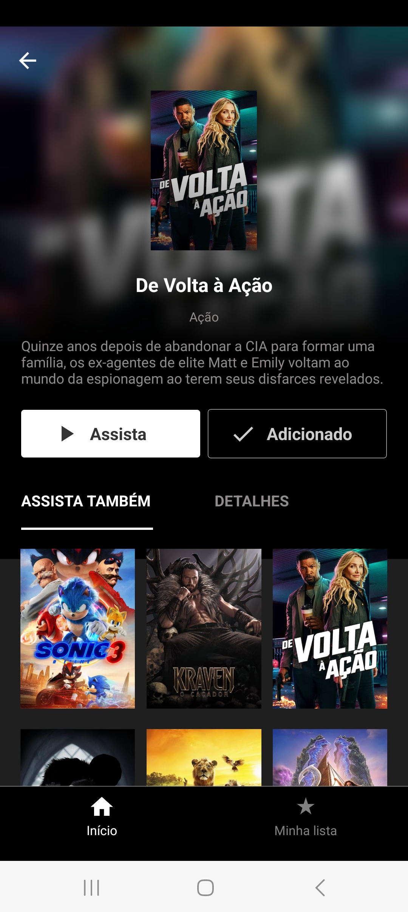

# Glovie By Joelson
Aplicativo criado para o desafio proposto pela Globo.

## Funcionalidades
- Listagem de filmes
- Favoritar/Desfavoritar
- Detalhes do filme

## Funcionalidades extras 
- Filtros
- Busca
- Paginação
- Animações
- Testes unitários
- Testes instrumentados
- Testes funcionais
- Pipeline automatizado
- Play do video (utilizando como base o trailer do filme do youtube, apenas para visualização)

## Tecnologias utilizadas
- React Native
- Javascript
- API REST (The Movie DB)
- Responsive Layout

## Screenshots

| Home                                                   | Detalhes                                                | Favoritado                                                 | Buscar                                                 |
|--------------------------------------------------------|---------------------------------------------------------|------------------------------------------------------------|--------------------------------------------------------|
|        |         |          |        

| Assista também                                         | Mais detalhes                                          | Minha lista                                               | Filtrar                                                  |
|--------------------------------------------------------|--------------------------------------------------------|-----------------------------------------------------------|----------------------------------------------------------|
|    |     |             |    |

| Paginação                                                 |
|--------------------------------------------------------|
|         |

## Como baixar
- Baixar ou clonar o repositório 
- Recomendado utilizar o node versão 20 >
- Rodar o npm install à partir da pasta principal "GlovieByJoe"
- Rodar o npm start para iniciar o app
- Para utilização na versão web apertar a tecla "W", caso queira utilizar no android ou iOS, baixar o app Expo Go (Pois o app não está publicado nas lojas)
* Em casos de erros na inicialização do npm start, remover a pasta "node_modules" e o arquivo "package-lock.json", rodar novamente o npm install para recriar o pacote de bibliotecas
